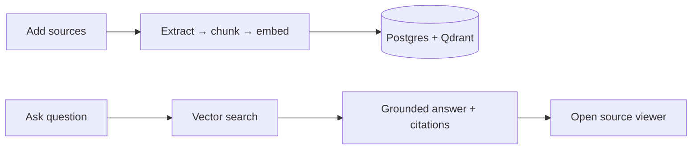

# Knowledge Workbench

NotebookLM-style research assistant: create notebooks, add sources (PDF, text, websites, YouTube, VTT), ask grounded questions, and jump from citations back into the original material.

**Architecture (diagrams):** [docs/ARCHITECTURE.md](./docs/ARCHITECTURE.md)

## Stack

- **TanStack Start** + Router (file routes, server functions)
- **React 19** + Tailwind 4 + shadcn/Radix
- **Clerk** auth
- **PostgreSQL** + Drizzle (metadata, chunk text, chat)
- **Qdrant** (embeddings)
- **OpenAI** (embeddings + chat)

## Quick start (local Bun)

### Prerequisites

- [Bun](https://bun.sh)
- Docker (Postgres + Qdrant)
- Clerk app keys
- OpenAI API key

### Setup

```bash
bun install
cp .env.example .env.local
# Fill in Clerk + OPENAI_API_KEY (DATABASE_URL / QDRANT_URL defaults match compose)
bun run db:migrate
bun run dev
```

App runs at [http://localhost:3000](http://localhost:3000).

## Docker (full stack)

Runs the app container with Postgres, Qdrant, migrations on boot, and a persistent `uploads` volume.

```bash
cp .env.example .env
# Fill VITE_CLERK_PUBLISHABLE_KEY, CLERK_SECRET_KEY, OPENAI_API_KEY
docker compose --profile app up --build -d
```
App: [http://localhost:3000](http://localhost:3000)
Compose wires `DATABASE_URL` / `QDRANT_URL` to the internal services. Set `S3_*` in `.env` if you want object storage instead of the uploads volume.

Build a standalone image:

```bash
docker build \
  --build-arg VITE_CLERK_PUBLISHABLE_KEY="$VITE_CLERK_PUBLISHABLE_KEY" \
  -t knowledge-workbench .
```

### Scripts

| Command | Purpose |
|---------|---------|
| `bun run dev` | Dev server (port 3000) |
| `bun run build` | Production build (Nitro Bun → `.output`) |
| `bun run start` | Run production server |
| `bun run check` | Biome lint + format |
| `bun run db:generate` | Generate Drizzle migrations |
| `bun run db:migrate` | Apply migrations |
| `bun run db:studio` | Drizzle Studio |

## How it works (short)



1. Create a notebook (owned by your Clerk user).
2. Add sources — indexing runs in the background; the UI listens via SSE.
3. Ask questions — retrieval pulls top chunks, the LLM answers with citations.
4. Click a citation to open the source viewer at the relevant page, offset, or timestamp.

Full diagrams, data model, and request flows: [docs/ARCHITECTURE.md](./docs/ARCHITECTURE.md).

## Project layout

```
src/
├── features/       # Server functions (notebooks, sources, chat, roadmap)
├── lib/rag/        # Extract, chunk, embed, index, LLM
├── lib/qdrant/     # Vector collection + search
├── db/schema/      # Postgres tables
├── components/     # Workspace, dashboard, viewers
└── routes/         # Pages + SSE source-events API
```

## Environment

Copy [`.env.example`](./.env.example) to `.env.local` (Bun) or `.env` (Docker Compose). Required:

- `VITE_CLERK_PUBLISHABLE_KEY` / `CLERK_SECRET_KEY`
- `DATABASE_URL`
- `OPENAI_API_KEY`
- `QDRANT_URL` (default `http://localhost:6333`)

Optional: `S3_*` for object storage instead of local `UPLOAD_DIR`.

## License

Private project.
