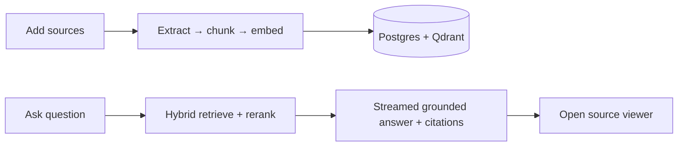

# Knowledge Workbench

NotebookLM-style research assistant: create notebooks, add sources (PDF, text, websites, YouTube, VTT), ask grounded questions, and jump from citations back into the original material.

**Architecture (diagrams):** [docs/ARCHITECTURE.md](./docs/ARCHITECTURE.md)

## Stack

- **TanStack Start** + Router (file routes, server functions)
- **React 19** + Tailwind 4 + shadcn/Radix
- **Clerk** auth
- **PostgreSQL** + Drizzle (metadata, chunk text, chat)
- **Qdrant** (embeddings)
- **OpenAI** (embeddings + chat)

## Quick start (local Bun)

```bash
bun install
cp .env.example .env.local
bun run db:migrate
bun run dev
```

App: [http://localhost:3000](http://localhost:3000).

## Deploy on VPS (app + Caddy)

Postgres and Qdrant stay **external** (Neon/Supabase + Qdrant Cloud). The VPS runs the **app** and **Caddy** (HTTPS). Only Caddy exposes `80` / `443`.

### 1. Prepare managed services

- Create a Postgres database → `DATABASE_URL`
- Create a **Qdrant Cloud** cluster (prefer a region near your VPS) → `QDRANT_URL` + `QDRANT_API_KEY`
  - Use `https://….aws.cloud.qdrant.io` **without** `:6333` (the app forces HTTPS port 443)
- Prefer **S3 or Cloudflare R2** for uploads (`S3_*`)
- Point your domain’s **A/AAAA** records at the VPS

### 2. On the VPS

```bash
git clone <your-repo> && cd knowledge-workbench
cp .env.example .env
# Set DOMAIN, Clerk, OPENAI_API_KEY, DATABASE_URL, QDRANT_URL, QDRANT_API_KEY

# Open firewall: 80 and 443 (not 3000)
docker compose -f docker-compose.prod.yml up --build -d
```

Migrations run automatically on app container start. Caddy issues a Let’s Encrypt cert for `DOMAIN`.

**YouTube on a VPS:** paste the URL as usual. The app tries browser caption fetch first, then server-side `youtube-transcript`, then **yt-dlp** (bundled in the Docker image). Optional `YOUTUBE_PROXY_URL` remains a last-resort residential proxy.

```bash
docker compose -f docker-compose.prod.yml logs -f
docker compose -f docker-compose.prod.yml down
```

### 3. Clerk

In Clerk, add `https://your.domain.com` to allowed origins / redirect URLs.

### Scripts

| Command | Purpose |
|---------|---------|
| `bun run dev` | Dev server (port 3000) |
| `bun run build` / `start` | Production build & run (without Docker) |
| `bun run db:migrate` | Apply migrations (also runs in container entrypoint) |
| `bun run eval:rag` | Run tiny RAG retrieval regression checks |

## How it works (short)



Full diagrams: [docs/ARCHITECTURE.md](./docs/ARCHITECTURE.md).

## Environment

| Variable | Notes |
|----------|--------|
| `DOMAIN` | Caddy site address (auto HTTPS via Let’s Encrypt) |
| `VITE_CLERK_PUBLISHABLE_KEY` / `CLERK_SECRET_KEY` | Required; publishable key is baked at **image build** time |
| `DATABASE_URL` | External Postgres |
| `QDRANT_URL` / `QDRANT_API_KEY` | Qdrant Cloud HTTPS URL (no `:6333`) + API key |
| `OPENAI_API_KEY` | Required |
| `YOUTUBE_PROXY_URL` | Optional residential proxy for YouTube captions on VPS |
| `S3_*` | Recommended on VPS instead of local disk |

## License

Private project.
