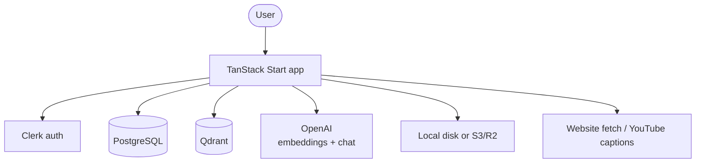
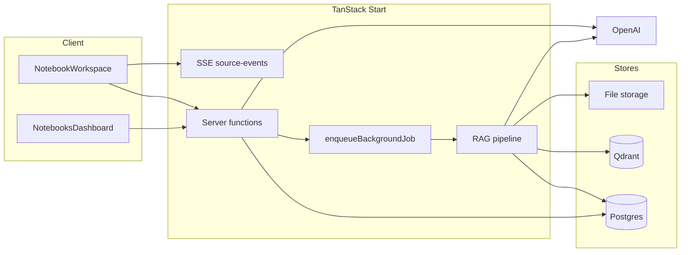
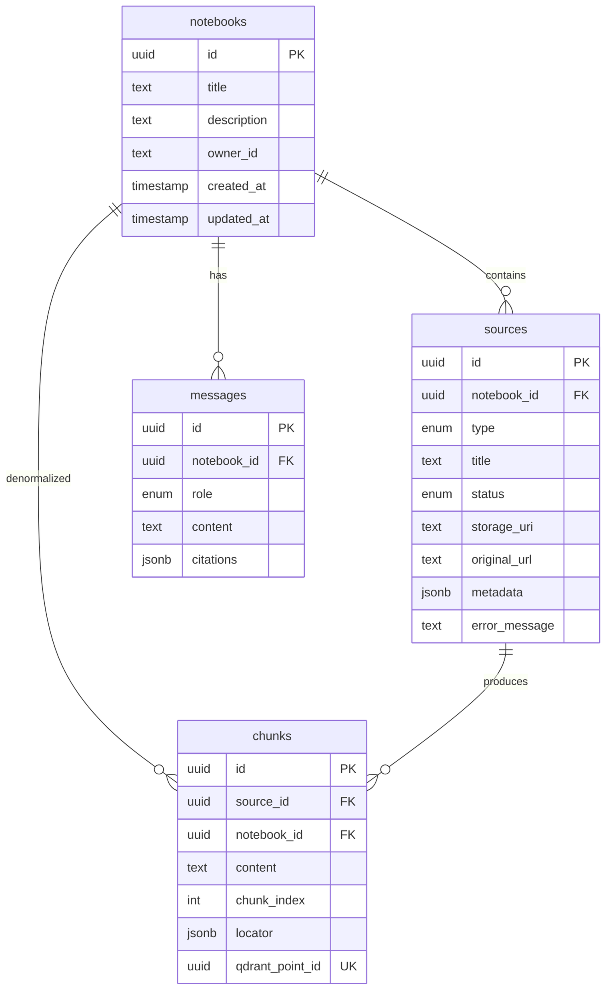
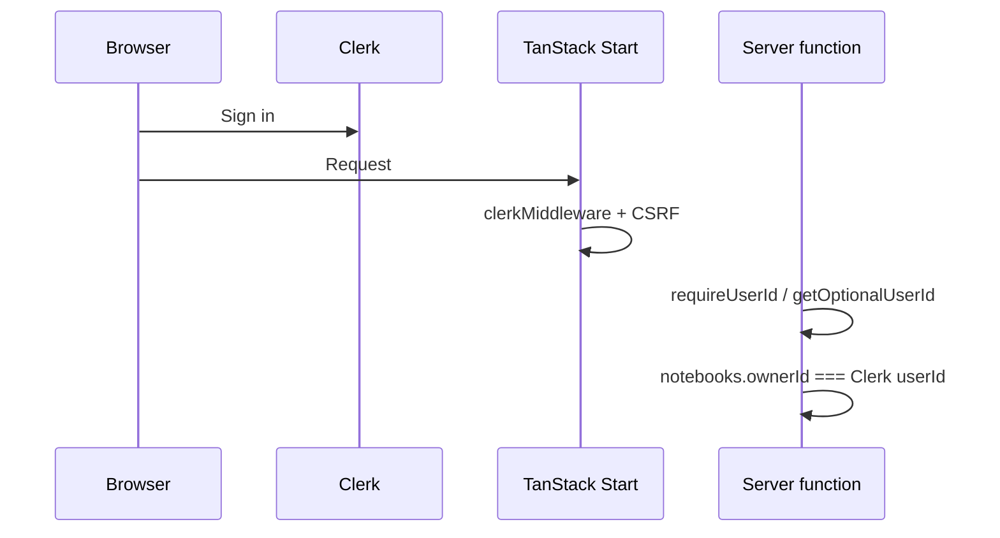
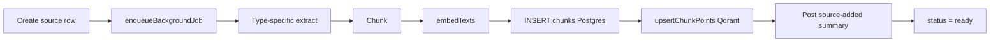
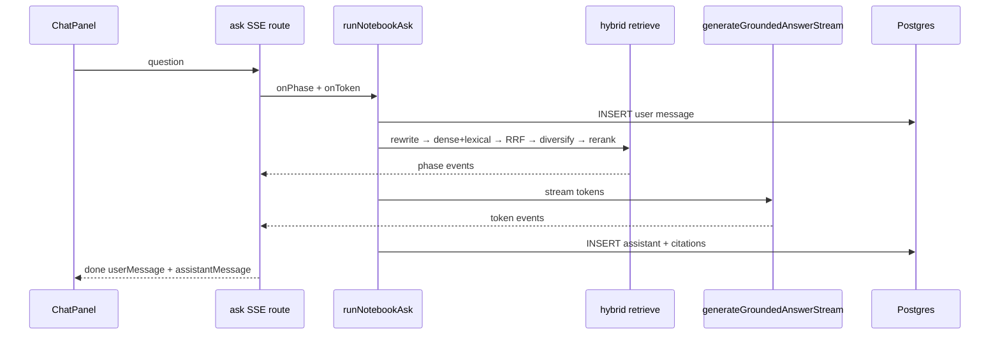
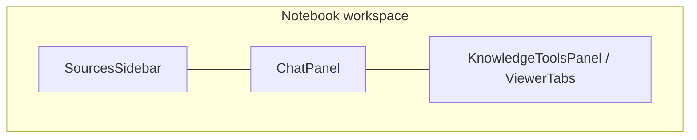
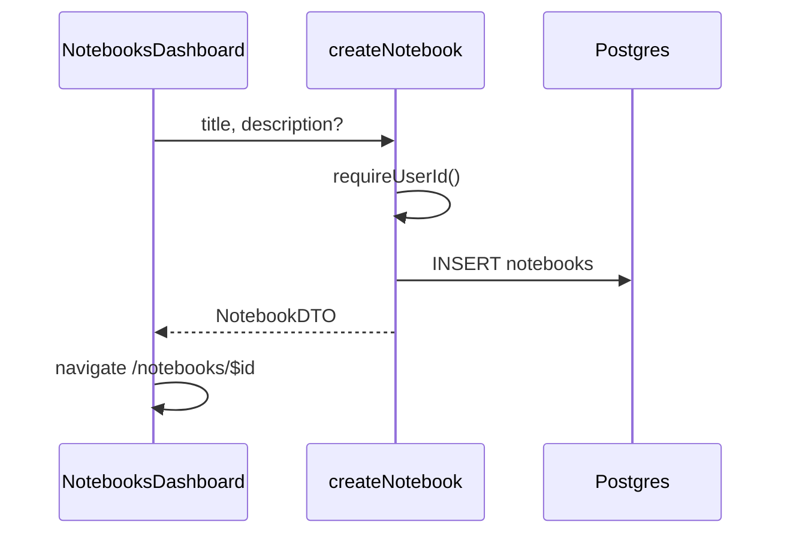
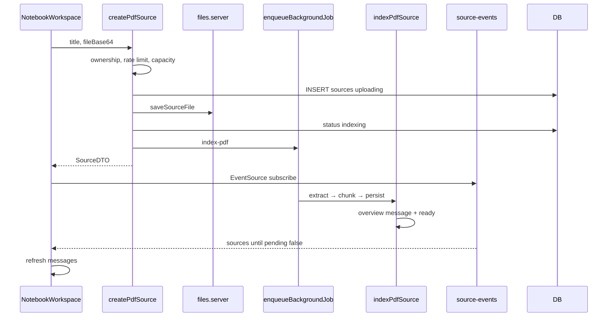

# Knowledge Workbench — Architecture

NotebookLM-style research assistant: users create **notebooks**, add **sources** (PDF, text, website, YouTube, VTT), and ask **grounded questions** with citations that open the original material in a source viewer.

## System context



| Layer | Choice | Primary paths |
|--------|--------|----------------|
| Runtime | Bun | `package.json` |
| Framework | TanStack Start + Router | `src/start.ts`, `src/routes/` |
| UI | React 19, Tailwind 4, shadcn/Radix | `src/components/` |
| Auth | Clerk | `src/integrations/clerk/`, `src/lib/auth.server.ts` |
| Metadata DB | PostgreSQL + Drizzle | `src/db/` |
| Vectors | Qdrant | `src/lib/qdrant/` |
| AI | OpenAI embeddings + chat | `src/lib/rag/embed.ts`, `src/lib/rag/llm.ts` |
| Files | Local disk or S3/R2 | `src/lib/storage/files.server.ts` |

---

## Repository layout

```
src/
├── start.ts                 # CSRF + Clerk request middleware
├── router.tsx               # Router factory
├── routes/                  # File-based routes + SSE API
├── features/                # Server functions (RPC boundary)
│   ├── notebooks/
│   ├── sources/
│   ├── chat/
│   └── roadmap/
├── lib/
│   ├── auth.server.ts
│   ├── rag/                 # Extract → chunk → embed → index → LLM
│   ├── qdrant/              # Collection + point ops
│   ├── storage/             # PDF / VTT binaries
│   └── ingest/              # Background jobs, rate limits
├── db/schema/               # Postgres tables
├── components/
│   ├── workspace/           # Three-panel notebook UI
│   ├── notebook/            # Source viewers, roadmap
│   └── dashboard/
└── integrations/            # Clerk, TanStack Query
```

**Boundaries**

- `features/*` — public server API (`createServerFn`), authz, orchestration
- `lib/rag/*` + `lib/qdrant/*` — RAG engine
- `components/workspace/*` — notebook shell and UX wiring

---

## Logical architecture



---

## Data model

Identity is Clerk `userId` stored on `notebooks.ownerId` — there is no app users table.

### Entity relationships



### Dual store

| Store | Owns |
|--------|------|
| **Postgres** | Notebooks, sources, chunk text, locators, chat messages |
| **Qdrant** (`knowledge_chunks`) | Embedding vectors + payload (`notebookId`, `sourceId`, `chunkId`, `ownerId`, `text`, `locator`, …) |

Rows and points stay aligned via `chunks.qdrantPointId` (same UUID as the Qdrant point id). See `src/lib/qdrant/points.ts`.

### Source types and status

- **Types**: `pdf` | `text` | `url` | `youtube` | `vtt`
- **Status**: `uploading` → `indexing` → `ready` | `failed`

Index progress is stored in `sources.metadata.indexProgress` with phases: `queued` → `extracting` → `embedding` → `storing` → `finalizing`.

### Locators and citations

`ChunkLocator` drives the viewer and citation jump:

- PDF / text: `page`, `startOffset` / `endOffset`
- Website: `url`, `heading`
- YouTube / VTT: `videoId`, `tStart` / `tEnd`, `cueIndex` / `cueIndexes`

Assistant messages store `MessageCitation[]` (chunk id, source id, quote, locator, citation number).

---

## Auth and access control



- Global middleware in `src/start.ts`: CSRF on server functions + `clerkMiddleware()`
- Route guard: `src/routes/_authenticated.tsx` — unsigned users redirect to `/`
- Ownership: `requireOwnedNotebook` / `requireOwnedSource` in `src/features/sources/notebook-access.server.ts`

---

## RAG pipeline

### Ingest (source → vectors)

Core persist path: `persistSourceChunks` / `indexSourceChunks` in `src/lib/rag/index-source.server.ts`.



| Type | Indexer | Extract | Chunk |
|------|---------|---------|-------|
| text | `indexTextSource` | content in metadata | `chunkPlainText` |
| pdf | `indexPdfSource` | `extractPdfPages` | `chunkPages` |
| url | `indexUrlSource` | `extractUrlArticle` (Readability) | `chunkArticleText` |
| youtube | `indexYoutubeSource` | `extractYoutubeTranscript` | `chunkVttCues` |
| vtt | `indexVttSource` | `parseWebVtt` | `chunkVttCues` |

Background work uses same-process `enqueueBackgroundJob` (`setTimeout(0)`) — not a Redis/Bull queue. See `src/lib/ingest/jobs.server.ts`.

On Qdrant failure after Postgres insert, `clearSourceIndex` rolls back vectors and chunk rows.

### Retrieve → generate (Q&A)

Primary UX path: `POST /api/notebooks/$notebookId/ask` (SSE) → `runNotebookAsk` in `src/features/chat/ask-notebook.server.ts`.  
`askNotebook` server function remains as a non-streaming wrapper.



Retrieval stack (`src/lib/rag/hybrid-retrieve.server.ts`):

1. Query rewrite (+ chat history for follow-ups)
2. Multi-query dense search (Qdrant) + Postgres FTS (`chunks.search_vector` GIN)
3. Reciprocal Rank Fusion
4. Time diversify (YouTube/VTT)
5. LLM rerank shortlist

Defaults:

- Embedding: `text-embedding-3-small` (1536 dims)
- Chat: `gpt-4o-mini`
- Final context: 8 chunks after diversify + rerank
- Qdrant: Cosine similarity; payload indexes on `notebookId`, `sourceId`, `ownerId`
- FTS: generated `search_vector` column (see `drizzle/0001_chunks_search_vector.sql`)

Eval: `bun run eval:rag -- --notebook <uuid>` (`scripts/eval-rag.ts`).

After indexing, `tryPostSourceAddedSummaryMessage` posts a source overview into chat before status becomes `ready`.

### Learning roadmap

`buildLearningRoadmap` (`src/features/roadmap/roadmap.functions.ts`) builds a structured learning path from YouTube transcript chunks via `src/lib/rag/generate-roadmap.server.ts`.

---

## Frontend workspace

Orchestrator: `NotebookWorkspace` (`src/components/workspace/NotebookWorkspace.tsx`).



| Panel | Components | Role |
|-------|------------|------|
| Left | `SourcesSidebar`, `SourceCard`, `AddSourceSheet` | List / add / delete sources |
| Center | `ChatPanel`, `ChatBubble`, `ChatComposer`, `CitationBadge` | Grounded Q&A |
| Right | `ViewerTabs` → Source / Summary / Learn / Metadata | Inspect citations and tools |

Layout widths persist in `localStorage` via `useWorkspaceLayout`. Mobile uses sheets for sources and tools.

While any source is `uploading` or `indexing`, the workspace opens an `EventSource` to:

`GET /api/notebooks/$notebookId/source-events`

which polls source status (~1s) until nothing is pending, then refreshes messages for the auto overview.

---

## Routes and server API

### HTTP routes

| Route | File | Role |
|-------|------|------|
| `/` | `src/routes/index.tsx` | Marketing + sign-in |
| `/_authenticated` | `src/routes/_authenticated.tsx` | Auth guard |
| `/notebooks/` | `.../notebooks/index.tsx` | Dashboard |
| `/notebooks/$notebookId` | `.../notebooks/$notebookId.tsx` | Workspace |
| `/api/notebooks/$notebookId/source-events` | `.../source-events.ts` | SSE indexing updates |

### Server functions

| Domain | File | Functions |
|--------|------|-----------|
| Notebooks | `notebooks.functions.ts` | `listNotebooks`, `getNotebook`, `createNotebook`, `updateNotebook`, `deleteNotebook`, `getAuthSession` |
| Sources | `sources.functions.ts` | `listSources`, `create*Source`, `reindexSource`, `deleteSource`, `getSourceFile` |
| Chat | `chat.functions.ts` + `ask-notebook.server.ts` | `listMessages`, `askNotebook`, SSE `ask` route, `getSourceViewer` |
| Roadmap | `roadmap.functions.ts` | `buildLearningRoadmap` |

---

## Key flows

### Create notebook



Workspace loader loads `getNotebook` + `listSources` + `listMessages` in parallel.

### Add PDF source



URL and YouTube skip binary storage; text content lives in `sources.metadata`. If the notebook is still untitled, the first sources can auto-derive a title.

### Citation → viewer

Clicking a citation calls `getSourceViewer`, opens the right panel on the Source tab, and highlights via the chunk locator (page, offsets, or transcript time).

### Delete

- **Source**: `clearSourceIndex` → `deleteSourceFile` → DELETE source (chunks cascade)
- **Notebook**: DELETE notebook cascades sources, chunks, and messages

---

## Ingest limits

Configured in `src/lib/ingest/limits.ts` (examples):

- 50 sources per notebook
- Rate limits on create (e.g. 20 creates / 10 min)
- Text ~200k chars; PDF ~30MB; VTT ~10MB

---

## Configuration

See [`.env.example`](../.env.example).

| Variable | Purpose |
|----------|---------|
| `VITE_CLERK_PUBLISHABLE_KEY`, `CLERK_SECRET_KEY` | Clerk |
| `DATABASE_URL` | Postgres |
| `QDRANT_URL`, `QDRANT_API_KEY`, `QDRANT_COLLECTION` | Qdrant |
| `UPLOAD_DIR` | Local uploads root |
| `S3_*` | Optional object storage |
| `OPENAI_API_KEY`, `OPENAI_EMBEDDING_MODEL`, `OPENAI_CHAT_MODEL` | OpenAI |

Local Qdrant:

```bash
docker compose up -d
```

---

## Design notes

1. **Postgres is source of truth for text**; Qdrant is the ANN index. Always keep `qdrantPointId` in sync.
2. **In-process background jobs** keep the stack simple; they do not survive process restarts mid-index.
3. **SSE** is the live indexing channel — not WebSockets.
4. **Grounded answers** require `[n]`-style citations from retrieved context; the UI maps those to `MessageCitation` and the viewer.
5. **Ownership checks on every mutating server function** are the security boundary; client `<Show when="signed-in">` is presentation only.
